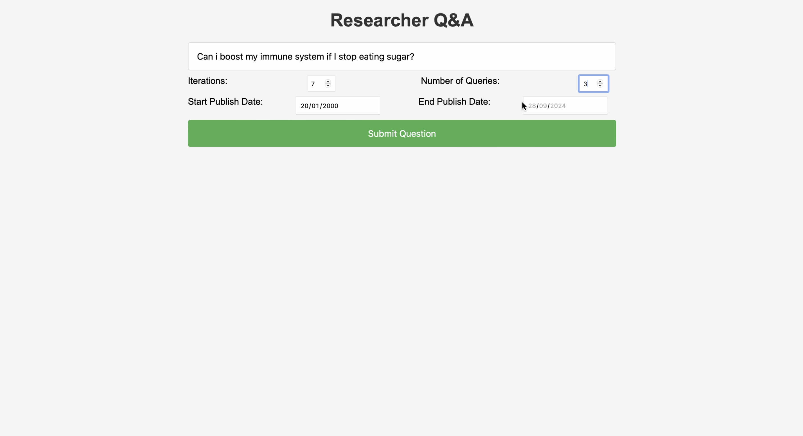

# NerdQA: Advanced Research Automation

<div align="center">
  
[](https://choosealicense.com/licenses/mit/)
[](https://youtu.be/suZp-q8rwEQ)

</div>

<p align="center">
  
</p>

## 🚀 About the Project

NerdQA is a deep research automation system that I implemented 6 months before OpenAI announced its Deep Research agent. This project was born from the belief that research automation is one of the most important applications of AI, with the potential to revolutionize knowledge work.

### 🛠️ Tech Stack

- **Core**: Custom LLM framework for orchestration (no dependencies on LangChain, etc.)
- **LLM**: LiteLLM proxy for reliable API access with fallbacks and Redis caching
- **Search**: Exa Search for web search capabilities
- **Reranking**: Cohere Reranker for improved search result relevance
- **Monitoring**: Langfuse for comprehensive LLM tracing
- **Frontend**: Vanilla JavaScript for a lightweight, customizable UI

### 🌟 Why Not Agent-Based?

Unlike common agent-based approaches, NerdQA uses an engineered LLM workflow in a loop that can explore research questions both vertically (for a predefined number of steps) and horizontally (making a defined number of parallel queries). This approach offers several advantages:

- **Deterministic Behavior**: More predictable outcomes with less randomness
- **Easier Troubleshooting**: Clear workflow steps make debugging simpler
- **Cost Efficiency**: Optimized prompts and controlled token usage keep costs low
- **Simplified Development**: Built as a budget-free pet project in personal time

<p align="center">
  
</p>

## ✨ What Makes NerdQA Unique

The most novel aspect of NerdQA is its **hierarchical statement architecture**. When generating intermediate or final reports, the LLM can cite not only original web sources but also intermediate statements that are built on top of other statements and sources. This creates citation trees that can:

1. Unlock complex conclusions not explicitly stated in sources
2. Support reasoning that builds safely on multiple pieces of evidence
3. Be extended to generate novel solutions by producing both strict synthesis and hypotheses

This approach enables the system to create deep, well-supported research reports with transparent reasoning chains that can be traced back to original sources.

<p align="center">
  
</p>

## 🏗️ System Architecture

NerdQA consists of several key components:

- **Pipeline**: Orchestrates the research workflow, managing statement generation, query generation, and answer synthesis
- **Statement Generator**: Creates factual statements based on search results
- **Query Generator**: Formulates follow-up queries based on current research state
- **Answer Generator**: Synthesizes final answers with citations to statements and sources
- **Web Server**: Provides API endpoints for interacting with the system
- **Frontend**: Simple, customizable vanilla JavaScript interface

The system uses a loop-based approach where each iteration:
1. Generates queries based on the research question
2. Searches for relevant information
3. Creates statements from search results
4. Builds on previous statements to generate deeper insights
5. Eventually synthesizes a comprehensive answer

## 📋 Installation

### Prerequisites

- Docker and Docker Compose
- API keys for:
  - OpenAI API
  - Cohere API
  - Exa Search API
  - (Optional) Langfuse API for tracing

### Quick Start

The easiest way to get started is using the provided `run.sh` script:

```bash
# Clone the repository
git clone https://github.com/yourusername/NerdQA.git
cd NerdQA

# Make the script executable
chmod +x run.sh

# Run the setup script
./run.sh
```

The script will:
1. Check for required environment variables
2. Prompt you to enter any missing API keys
3. Build and start the Docker container
4. Launch all necessary services

### Manual Setup

If you prefer to set up manually:

1. Copy the environment template:
   ```bash
   cp backend/config/.env.dist backend/config/.env
   ```

2. Edit the `.env` file to add your API keys:
   ```
   OPENAI_API_KEY="your-openai-key"
   COHERE_API_KEY="your-cohere-key"
   EXA_SEARCH_API_KEY="your-exa-search-key"
   
   # Optional Langfuse credentials for LLM tracing
   LANGFUSE_PUBLIC_KEY="your-langfuse-public-key"
   LANGFUSE_SECRET_KEY="your-langfuse-secret-key"
   LANGFUSE_HOST="https://us.cloud.langfuse.com"
   ```

3. Build and run with Docker:
   ```bash
   docker build -t nerdqa .
   docker run -d \
       --name nerdqa \
       -p 8000:8000 \
       -p 8080:8080 \
       -p 6379:6379 \
       -p 4000:4000 \
       nerdqa
   ```

## 🧠 Usage

Once the application is running, you can access:

- Frontend interface: http://localhost:8080
- Backend API: http://localhost:8000
- LiteLLM Proxy: http://localhost:4000

### Research Process

1. Enter your research question in the main input field
2. Configure the number of iterations and queries per iteration
3. Set date ranges for the search if needed
4. Submit your question and watch as NerdQA explores the topic
5. Review the final report with citation trees showing the reasoning process

### Advanced Features

- **Citation Trees**: Click on citations in the final report to explore the evidence chain
- **Feedback**: Provide feedback on answers to improve future research
- **Custom Search Providers**: The system supports multiple search backends including Exa Search, Brave Search, and OpenAlex
- **LLM Tracing**: With Langfuse integration, you can inspect all LLM calls, prompts, token usage, timing, and more

## 🔧 Technical Details

### Caching

NerdQA uses Redis for LLM response caching to improve performance and reduce API costs. The Redis configuration is handled automatically in the Docker setup.

### LLM Integration

The system uses a proxy-based approach to LLM integration, allowing for easy switching between different providers and models.

### Tracing and Monitoring

When configured with Langfuse credentials, NerdQA provides comprehensive tracing of all LLM interactions:
- View complete prompt templates and rendered prompts
- Monitor token usage and costs
- Analyze timing and performance metrics
- Trace the full research workflow from question to answer

## 👥 Contributing

Contributions are welcome! Please feel free to submit a Pull Request.

## 📝 License

Released under the [MIT License](LICENSE).

---

<p align="center">
  <i>Built with ❤️ for the research and AI community</i>
</p>